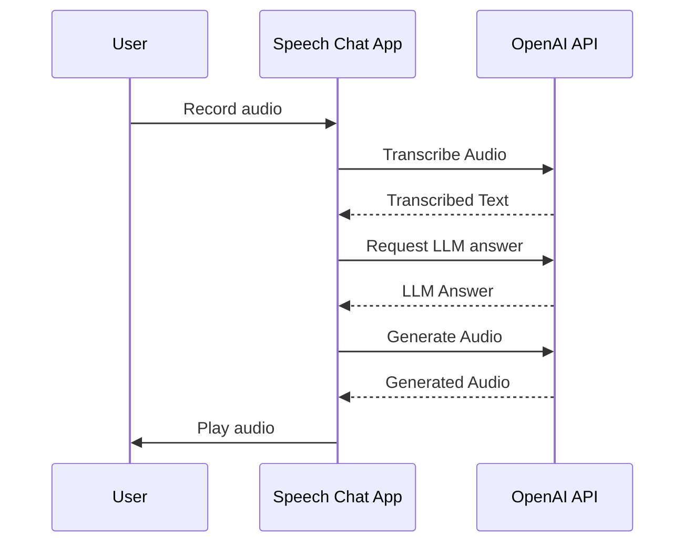

# Voice chat based on Text to Speech, Speech to text and LLMs

## Introduction

This project is a voice chat application that uses Text to Speech (TTS), Speech to Text (STT) and Language Models (LMs) to enable voice communication between a user and the application.
The application is built using Python.

## Architecture

The application is built using the following components:

- OpenAI API (Text to Speech, Speech to Text, Language Models)
- Python Sound Processing Libraries
- CLI Interface

This is a high-level diagram of the application's flow:



## Setup / Running the application

In order to perform the Text to Speech, Speech to Text and Language Model operations, you need to have an Azure OpenAI resource.

Before creating the resource, make sure the *tts* and *whisper* models are available in the selected region. The availability of the models for each region can be checked in the [Azure Open AI docs](https://learn.microsoft.com/azure/ai-services/openai/concepts/models#standard-deployment-model-availability)

After creating the resource, you need to create a deployment for the *tts* and *whisper* models. The deployment can be created in the Azure OpenAI Studio (which is accessible from the resource in the Azure Portal).

After creating these, make sure to fill out the *.env* file with the information from the Azure OpenAI resource. Hints are provided in the *.env.default* file.

After filling out the *.env* file, you can run the application using the following command:

```bash
python main.py
```

## Requirements

The following libraries are required to run the application:

- `openai` - OpenAI's Python library
- `sounddevice` - Sound processing library
- `scipy` - Scientific computing library

## Related Links

- [Text to Speech](https://platform.openai.com/docs/guides/text-to-speech)
- [Speech to Text](https://platform.openai.com/docs/guides/speech-to-text)
- [Text Generation](https://platform.openai.com/docs/guides/text-generation)
